# NFT 拍卖市场

> 使用 Foundry 框架开发的 NFT 拍卖市场，支持 ETH 和 ERC20 代币出价，集成 Chainlink 预言机，使用 UUPS 代理模式实现合约升级。

---

## 项目简介

本项目是一个功能完整的 NFT 拍卖市场智能合约系统，实现了以下核心功能：

- **NFT 管理**: 基于 ERC721 标准的 NFT 铸造、销毁和转移
- **拍卖功能**: 支持创建拍卖、ETH/ERC20 出价、结束拍卖、取消拍卖
- **价格预言机**: 集成 Chainlink 价格预言机，实现实时 ETH 和 ERC20 到美元的价格转换
- **合约升级**: 使用 UUPS 代理模式，支持合约无缝升级（V1 固定手续费 → V2 动态手续费）
- **动态手续费**: 根据拍卖金额自动调整手续费率（额外挑战功能）

---

## 技术栈

| 技术 | 说明 |
|-----|------|
| **开发框架** | Foundry |
| **Solidity 版本** | ^0.8.20 |
| **NFT 标准** | ERC721 (OpenZeppelin) |
| **代理模式** | UUPS (ERC1967Proxy) |
| **价格预言机** | Chainlink Price Feeds |
| **测试网络** | Sepolia Testnet |

---

## 项目结构

```
nft-auction-market/
├── src/                           # 智能合约源代码
│   ├── interface/                 # 接口定义
│   │   ├── IAuction.sol          # 拍卖合约接口
│   │   └── INFTMarketplace.sol   # NFT 市场接口
│   ├── nft/                      # NFT 合约
│   │   └── NFTMarketplace.sol    # NFT 市场合约（ERC721）
│   └── auction/                  # 拍卖合约
│       ├── Auction.sol           # 拍卖合约基类（抽象）
│       ├── AuctionV1.sol         # V1 版本（固定手续费 2.5%）
│       ├── AuctionV2.sol         # V2 版本（动态手续费）
│       └── PriceConverter.sol    # Chainlink 价格转换库
│
├── test/                         # 测试文件
│   ├── nft/
│   │   └── NFTMarketplace.t.sol  # NFT 市场测试
│   └── auction/
│       ├── Auction.t.sol         # 拍卖合约基本功能测试
│       └── AuctionV2.t.sol       # 动态手续费测试
│
├── script/                       # 部署脚本
│   ├── deploy/
│   │   ├── DeployNFT.s.sol       # 部署 NFTMarketplace 合约
│   │   └── DeployAuction.s.sol   # 部署 AuctionV1 代理合约
│   ├── upgrade/
│   │   └── UpgradeAuction.s.sol  # 升级 Auction 到 V2 脚本
│   └── Interact.s.sol            # 合约交互脚本
│
├── doc/                          # 文档
│   ├── 提交内容指南.md
│   ├── 测试网部署指南.md
│   ├── 线上测试操作指南.md
│   └── 提交内容模板.md
│
├── foundry.toml                  # Foundry 配置文件
├── README.md                     # 项目文档
└── TEST_REPORT.md                # 测试报告
```

---

## 核心合约说明

### 1. NFTMarketplace.sol

NFT 市场合约，基于 ERC721 标准。

**主要功能**:
- `mint(address to, string memory uri)` - 铸造 NFT（仅 owner）
- `burn(uint256 tokenId)` - 销毁 NFT
- `tokenURI(uint256 tokenId)` - 查询 NFT 元数据
- `totalSupply()` - 查询总供应量
- `nextTokenId()` - 获取下一个可用的 token ID

---

### 2. Auction.sol (抽象基类)

拍卖合约的抽象基类，定义了核心拍卖逻辑。

**继承关系**:
```
Initializable
    ↓
OwnableUpgradeable
    ↓
ReentrancyGuardUpgradeable
    ↓
UUPSUpgradeable
    ↓
Auction (抽象)
    ↓
AuctionV1 / AuctionV2
```

**核心功能**:
| 函数 | 说明 |
|-----|------|
| `createAuction(...)` | 创建拍卖，支持指定 NFT、持续时间、最低出价、支付代币 |
| `placeBid(uint256)` | 使用 ETH 出价 |
| `placeBidWithToken(uint256, uint256)` | 使用 ERC20 代币出价 |
| `endAuction(uint256)` | 结束拍卖，NFT 转移给出价最高者 |
| `cancelAuction(uint256)` | 取消拍卖（仅卖家，无出价时） |
| `withdrawETH()` | 提取被超出的 ETH 出价 |
| `withdrawToken(address)` | 提取被超出的 ERC20 出价 |

**查询函数**:
| 函数 | 说明 |
|-----|------|
| `getAuction(uint256)` | 获取拍卖完整信息 |
| `getHighestBid(uint256)` | 获取当前最高出价 |
| `getAllBids(uint256)` | 获取所有出价记录 |

**管理函数** (仅 owner):
| 函数 | 说明 |
|-----|------|
| `setTokenPriceFeed(address, address)` | 设置 ERC20 代币的价格预言机 |
| `setFeeRate(uint256)` | 设置手续费率（V1） |
| `setFeeTier(uint256, uint256, uint256)` | 设置动态手续费层级（V2） |
| `setFeeRecipient(address)` | 设置手续费接收者 |
| `upgradeTo(address)` | 升级合约实现 |

---

### 3. AuctionV1.sol

拍卖合约 V1 版本，实现**固定手续费率 2.5%**。

**特点**:
- 简单固定的手续费机制
- 适合初始版本使用
- 可升级到 V2

---

### 4. AuctionV2.sol

拍卖合约 V2 版本，实现**动态手续费层级**（额外挑战功能）。

**手续费层级**:

| 拍卖成交金额 | 手续费率 |
|-------------|---------|
| < 1,000 USD | **3%** |
| 1,000 - 10,000 USD | **2.5%** |
| > 10,000 USD | **2%** |

**特点**:
- 根据成交金额自动调整费率
- 大额交易享受更低手续费
- 可配置的层级系统

---

### 5. PriceConverter.sol

Chainlink 价格转换工具库。

**功能**:
- `getETHPrice()` - 获取 ETH/USD 价格
- `getETHAmountInUSD(uint256)` - 将 ETH 金额转换为 USD
- `getTokenAmountInUSD(uint256)` - 将 ERC20 金额转换为 USD
- `compareBids(...)` - 比较两个出价的 USD 价值

---

## Chainlink 价格预言机集成

### Sepolia 测试网地址

| 代币对 | 合约地址 | Decimals |
|-------|---------|----------|
| ETH/USD | `0x694AA1769357215DE4FAC081bf1f309aDC325306` | 8 |
| BTC/USD | `0x1b44F3514812d835EB1BDB0acB33d3fA3351Ee43` | 8 |
| USDC/USD | `0xA2F78ab2355Fe2Cd48370b735A90A59a274934F8` | 8 |

> 更多地址: https://docs.chain.link/data-feeds/price-feeds/addresses

---

## 部署步骤

### 环境准备

1. **安装 Foundry**
   ```bash
   curl -L https://foundry.paradigm.xyz | bash
   foundryup
   ```

2. **克隆项目**
   ```bash
   git clone https://github.com/cjq02/solidity-task.git
   cd solidity-task/task3/nft-auction-market
   ```

3. **安装依赖**
   ```bash
   forge install
   ```

---

### 编译合约

```bash
# 编译所有合约
forge build

# 查看编译输出
ls -la out/
```

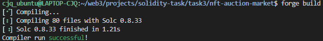

**编译输出示例**:
```
Compiler run successful
```

---

### 运行测试

```bash
# 运行所有测试
forge test -vv

# 运行测试并显示 Gas 报告
forge test --gas-report

# 生成测试覆盖率报告
forge coverage
```

**测试输出示例**:
```
Running 3 tests for test/NFTMarketplace.t.sol
[PASS] testInitialization() (gas: 285432)
[PASS] testMint() (gas: 156789)
[PASS] testBurn() (gas: 45123)
Test result: ok. 3 passed; 0 failed; finished
```

---

### 部署到 Sepolia 测试网

#### 1. 获取必要的配置信息

##### 1.1 获取 Infura RPC URL

Infura 是 ConsenSys（MetaMask 母公司）提供的免费 RPC 服务，操作简单：

1. **访问 Infura 官网**：https://www.infura.io/
2. **注册账号**：点击 **"Get Started"** 注册账号（可以使用邮箱或 MetaMask 钱包注册）
3. **创建 API Key**：
   - 登录后进入 Dashboard
   - 如果还没有 API Key，点击右上角紫色的 **"Create new API key"** 按钮
   - 输入 API Key 名称（如 "NFT Auction Market"）
   - 选择网络：在 "What network do you want to use first?" 部分，从下拉菜单选择 **"Sepolia"**
   - 点击 **"Create"** 完成创建
   - 复制显示的 RPC URL，格式如下：
     ```
     https://sepolia.infura.io/v3/YOUR_PROJECT_ID
     ```

   **注意**：免费计划通常只提供一个 API Key。如果已经有一个 API Key，继续使用现有的即可，无需创建新的。

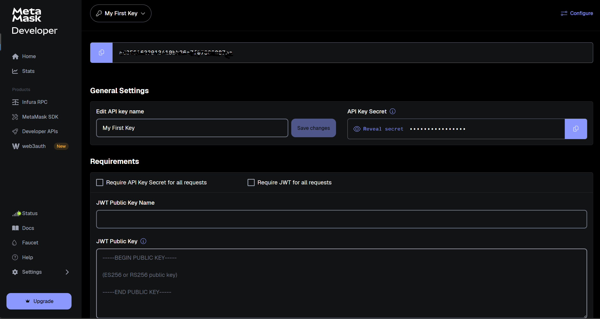
---

##### 1.2 获取 Etherscan API Key

1. 访问 https://etherscan.io/
2. 点击右上角 **"Sign In"** → **"Register"** 注册账号
3. 登录后，点击右上角头像 → **"API Keys"**
4. 滚动到 **"API Keys"** 部分
5. 点击 **"Add"** 添加新 API Key
6. 复制 **API Key Token**（是一串 32 位字符）

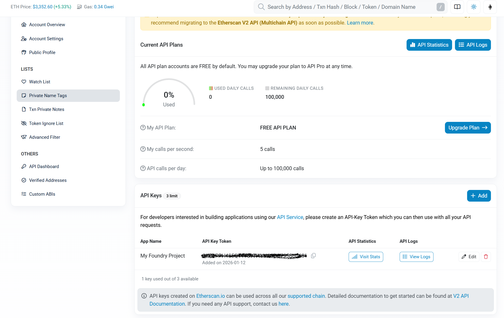

---

##### 1.3 获取 PRIVATE_KEY（从 MetaMask 导出）

**方法：从 MetaMask 导出私钥（已有钱包）**

1. 打开 MetaMask 浏览器扩展
2. 点击右上角 **三个点** 菜单 → **账户详情**
3. 向下滚动，找到 **"导出私钥"** 按钮
4. 点击导出，输入 MetaMask 密码确认
5. 复制显示的私钥
   - 格式：64 位十六进制字符
   - 示例：`abc123...789`（不带 0x 前缀）或 `0xabc123...789`（带 0x 前缀）
   - 在 `.env` 文件中使用时，**去掉 0x 前缀**

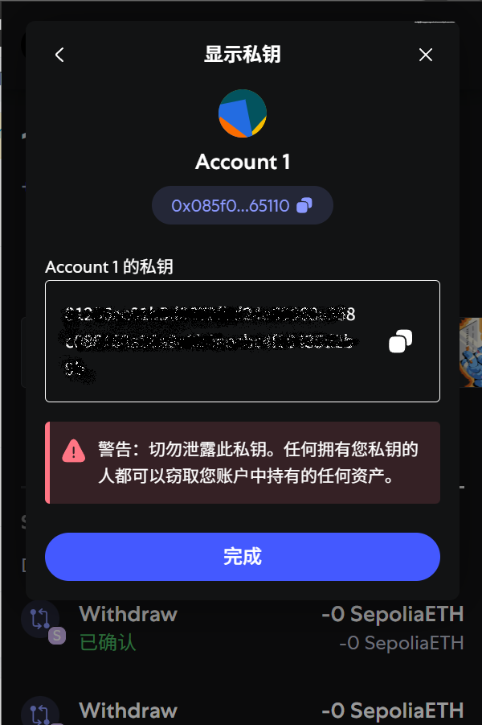

**安全提示** ⚠️：
- **永远不要**将私钥提交到 Git 仓库
- **永远不要**与他人分享你的私钥
- 只在测试网使用，不要在主网使用包含真实资产的账户

---

##### 1.4 准备其他配置

| 配置项 | 说明 | 值 |
|-------|------|-----|
| `ETH_PRICE_FEED` | Chainlink ETH/USD 价格预言机地址（Sepolia） | `0x694AA1769357215DE4FAC081bf1f309aDC325306` |
| `FEE_RECIPIENT` | 手续费接收地址 | 你的钱包地址 |

---

#### 2. 配置环境变量

在项目根目录创建 `.env` 文件，配置以下环境变量：

| 环境变量 | 说明 | 来源 |
|---------|------|------|
| `PRIVATE_KEY` | 部署钱包的私钥（不要包含 0x 前缀） | 从 MetaMask 导出 |
| `SEPOLIA_RPC_URL` | Infura Sepolia RPC 端点 | 从 Infura 获取（见上文） |
| `ETHERSCAN_API_KEY` | Etherscan API 密钥 | 从 Etherscan 获取（见上文） |
| `ETH_PRICE_FEED` | Chainlink ETH/USD 价格预言机地址 | `0x694AA1769357215DE4FAC081bf1f309aDC325306` |
| `FEE_RECIPIENT` | 手续费接收地址 | 你的钱包地址 |

---

#### 3. 部署 NFT 合约

```bash
# 加载环境变量并部署
source .env

forge script script/deploy/DeployNFT.s.sol \
  --rpc-url $SEPOLIA_RPC_URL \
  --broadcast \
  --verify \
  --etherscan-api-key $ETHERSCAN_API_KEY \
  --delay 15
```

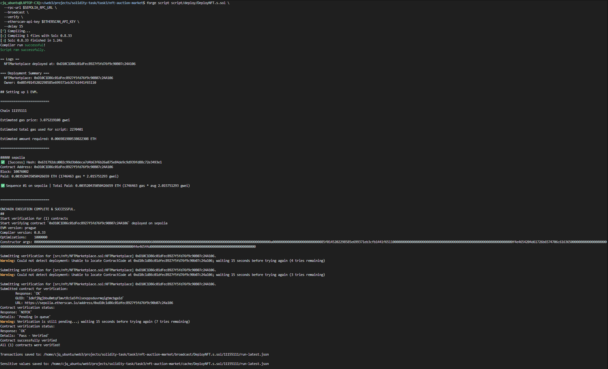

**部署信息**:

| 项目 | 值 |
|-----|---|
| 合约地址 | `0xD10C1D86c01dFec8927f5fd76f9c90B07c24A106` |
| 交易哈希 | `0x631792dcd002c99d3b0deca7d4b63f6b26a875e84de9c9d939fd88c72e3493e1` |
| Etherscan | [查看合约](https://sepolia.etherscan.io/address/0xD10C1D86c01dFec8927f5fd76f9c90B07c24A106) |

**部署命令说明**:
- `--rpc-url`: RPC 端点
- `--broadcast`: 广播交易到区块链
- `--verify`: 在 Etherscan 上验证合约
- `--etherscan-api-key`: Etherscan API 密钥
- `--delay 15`: 每次交易之间延迟 15 秒

---

#### 4. 部署拍卖合约（V1）

```bash
# 部署 AuctionV1 代理合约
forge script script/deploy/DeployAuction.s.sol \
  --rpc-url $SEPOLIA_RPC_URL \
  --broadcast \
  --verify \
  --etherscan-api-key $ETHERSCAN_API_KEY \
  --delay 15
```

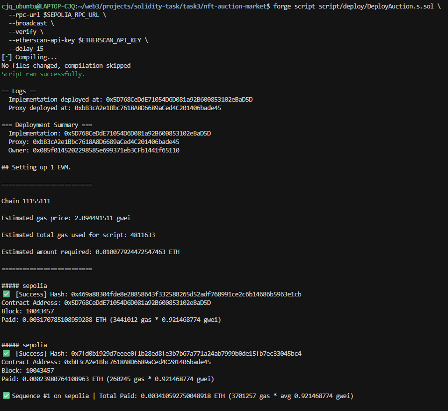

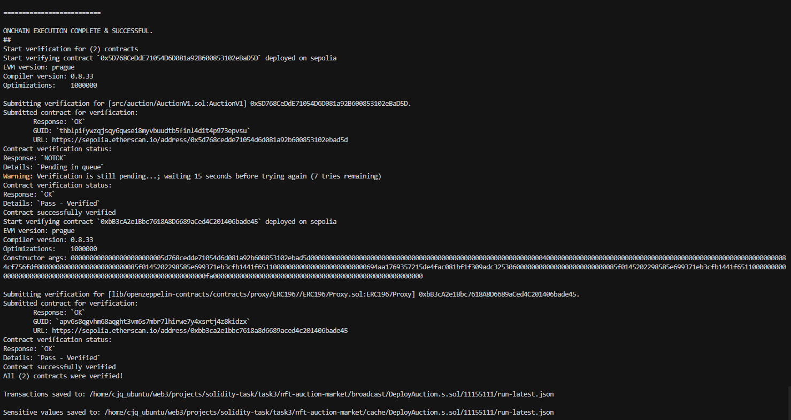

**部署信息**:

| 项目 | 值 |
|-----|---|
| 实现合约地址 | `0x5D768CeDdE71054D6D081a92B600853102eBaD5D` |
| 代理合约地址 | `0xbB3cA2e1Bbc7618A8D6689aCed4C201406bade45` |
| 实现合约交易哈希 | `0x469a88304fde8e28858643f332588265d52adf768991ce2c6b14686b5963e1cb` |
| 代理合约交易哈希 | `0x7fd0b1929d7eeee0f1b28ed8fe3b7b67a771a24ab7999b0de15fb7ec33045bc4` |
| Etherscan | [查看代理合约](https://sepolia.etherscan.io/address/0xbB3cA2e1Bbc7618A8D6689aCed4C201406bade45) |

**部署参数**:

| 参数 | 值 |
|-----|---|
| 初始 Owner | `0x085f0145202298585e699371eb3CFb1441f65110` |
| ETH 价格预言机 | `0x694AA1769357215DE4FAC081bf1f309aDC325306` |
| 手续费率 | 250 (2.5%) |
| 手续费接收者 | `0x085f0145202298585e699371eb3CFb1441f65110
` |

---

#### 5. 验证部署

使用 Cast 命令验证合约部署：

```bash
# 查询合约 owner
cast call <PROXY_ADDRESS> "owner()(address)" --rpc-url $SEPOLIA_RPC_URL

# 查询手续费率
cast call <PROXY_ADDRESS> "feeRate()(uint256)" --rpc-url $SEPOLIA_RPC_URL

# 查询 ETH 价格预言机
cast call <PROXY_ADDRESS> "ethPriceFeed()(address)" --rpc-url $SEPOLIA_RPC_URL
```

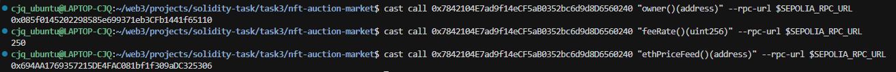

---

### 合约升级（V1 → V2）

#### 📖 关于 ERC-1967 存储槽

本项目使用 `ERC1967Proxy`（UUPS 代理模式），实现合约地址存储在 ERC-1967 标准定义的存储槽中。

**存储槽位置的计算方法：**

根据 ERC-1967 标准，实现合约地址的存储槽位置计算公式为：

```
存储槽 = keccak256("eip1967.proxy.implementation") - 1
```

**计算步骤：**

1. 计算字符串的 Keccak-256 哈希值：
   ```bash
   cast keccak "eip1967.proxy.implementation"
   # 结果：0x360894a13ba1a3210667c828492db98dca3e2076cc3735a920a3ca505d382bbd
   ```

2. 将哈希值减去 1，得到存储槽位置：
   ```
   0x360894a13ba1a3210667c828492db98dca3e2076cc3735a920a3ca505d382bbd - 1
   = 0x360894a13ba1a3210667c828492db98dca3e2076cc3735a920a3ca505d382bbc
   ```

**为什么使用标准化的存储槽？**

- ✅ 避免与实现合约的存储布局冲突
- ✅ 确保所有遵循 ERC-1967 标准的代理合约使用相同的存储位置
- ✅ 方便工具和前端直接读取实现地址

> **注意**：`ERC1967Proxy` 没有公开的 `implementation()` 函数，因此不能使用 `cast call` 直接调用。必须通过读取存储槽来获取实现地址。

---

#### 1. 准备升级

```bash
# 记录当前实现合约地址（读取 ERC-1967 存储槽）
cast storage <PROXY_ADDRESS> 0x360894a13ba1a3210667c828492db98dca3e2076cc3735a920a3ca505d382bbc --rpc-url $SEPOLIA_RPC_URL | cast parse-bytes32-address
```

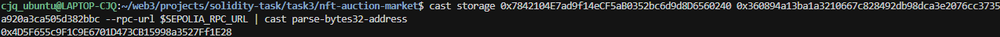

#### 2. 执行升级

```bash
# 升级到 AuctionV2
forge script script/upgrade/UpgradeAuction.s.sol \
  --rpc-url $SEPOLIA_RPC_URL \
  --broadcast \
  --verify \
  --etherscan-api-key $ETHERSCAN_API_KEY \
  --delay 15
```


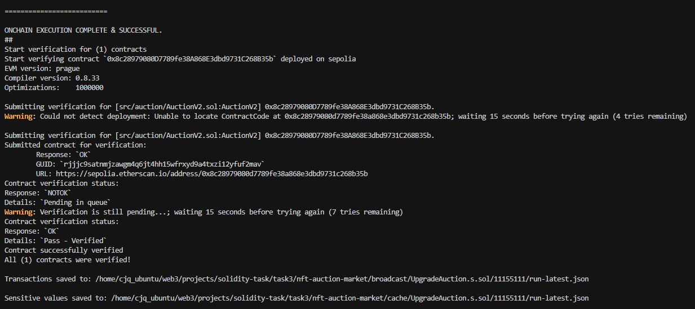

**升级信息**:

| 项目 | 值 |
|-----|---|
| V2 实现合约地址 | `0x8c28979080D7789fe38A868E3dbd9731C268B35b` |
| 升级交易哈希 | `0x10c9b17b012233f4ffed890286945144baf20d4e2e0d1b18522533629349be1a` |
| 部署交易哈希 | `0x0b357cf44ae043c383b21df6fb4c8a932fb4ee6eb86147c5ac43344d6fa6402a` |
| Etherscan | [查看实现合约](https://sepolia.etherscan.io/address/0x8c28979080D7789fe38A868E3dbd9731C268B35b) |

#### 3. 验证升级

```bash
# 验证实现合约已更改（读取 ERC-1967 存储槽）
cast storage <PROXY_ADDRESS> 0x360894a13ba1a3210667c828492db98dca3e2076cc3735a920a3ca505d382bbc --rpc-url $SEPOLIA_RPC_URL | cast parse-bytes32-address

# 可选：调用 V2 特有函数验证（验证合约已升级到 V2）
# 注意：getFeeTiers() 返回数组，在命令行中可能显示不完整，但可以验证函数存在
cast call <PROXY_ADDRESS> "getFeeTiers()((uint256,uint256)[])" --rpc-url $SEPOLIA_RPC_URL
```

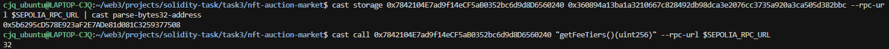

---

### 部署检查清单

- [ ] Foundry 安装成功
- [ ] 项目依赖安装完成
- [ ] 合约编译成功（`forge build`）
- [ ] 测试全部通过（`forge test -vv`）
- [ ] Infura RPC URL 获取成功
- [ ] Etherscan API Key 获取成功
- [ ] .env 文件配置正确
- [ ] 测试账户有足够 ETH（至少 0.5 ETH）
- [ ] NFT 合约部署成功
- [ ] 拍卖合约部署成功
- [ ] 合约在 Etherscan 上验证通过
- [ ] 合约功能验证正常
- [ ] 合约升级成功（V1 → V2）

---

## 使用示例

### 创建 NFT 拍卖

```solidity
// 创建一个 7 天拍卖，最低出价 100 USD，接受 ETH 出价
auction.createAuction(
    nftContract,      // NFT 合约地址
    tokenId,          // NFT ID
    7 days,           // 拍卖持续时间
    100 USD,          // 最低出价（美元）
    address(0)        // address(0) 表示接受 ETH
);
```

### 出价

```solidity
// 使用 ETH 出价
auction.placeBid{value: 0.05 ether}(auctionId);

// 使用 ERC20 代币出价（需先授权）
auction.placeBidWithToken(auctionId, 500 * 10^18);
```

### 结束拍卖

```solidity
// 拍卖时间结束后，任何人都可以调用
auction.endAuction(auctionId);
```

---

## 已部署合约信息

### Sepolia 测试网

| 合约 | 地址 | Etherscan |
|-----|------|-----------|
| NFTMarketplace | `0x41B2eA52228706FD2a1c81Ab9713A71a710072b4` | [查看](https://sepolia.etherscan.io/address/0x41B2eA52228706FD2a1c81Ab9713A71a710072b4) |
| Auction Proxy | `0x7842104E7ad9f14eCF5aB0352bc6d9d8D6560240` | [查看](https://sepolia.etherscan.io/address/0x7842104E7ad9f14eCF5aB0352bc6d9d8D6560240) |
| Auction Implementation (V1) | `0x4D5F655c9F1C9E6701D473CB15998a3527Ff1E28` | [查看](https://sepolia.etherscan.io/address/0x4D5F655c9F1C9E6701D473CB15998a3527Ff1E28) |
| Auction Implementation (V2) | `0x5b6295cD578E923aF2E7ADe81d081C3259377508` | [查看](https://sepolia.etherscan.io/address/0x5b6295cD578E923aF2E7ADe81d081C3259377508) |

---

## 项目亮点

1. **完整的 UUPS 代理模式**
   - 支持合约无缝升级
   - 升级后数据完整保留
   - 演示了 V1 到 V2 的平滑升级

2. **灵活的支付方式**
   - 同时支持 ETH 和 ERC20 代币
   - 可配置任意 ERC20 代币
   - Chainlink 实时价格转换

3. **动态手续费系统**（额外挑战）
   - 根据拍卖金额自动调整手续费率
   - 大额交易享受更低费率
   - 可扩展的层级配置

4. **安全机制**
   - 重入攻击保护（ReentrancyGuard）
   - 权限控制（Ownable）
   - 价格数据验证
   - 出价验证机制
